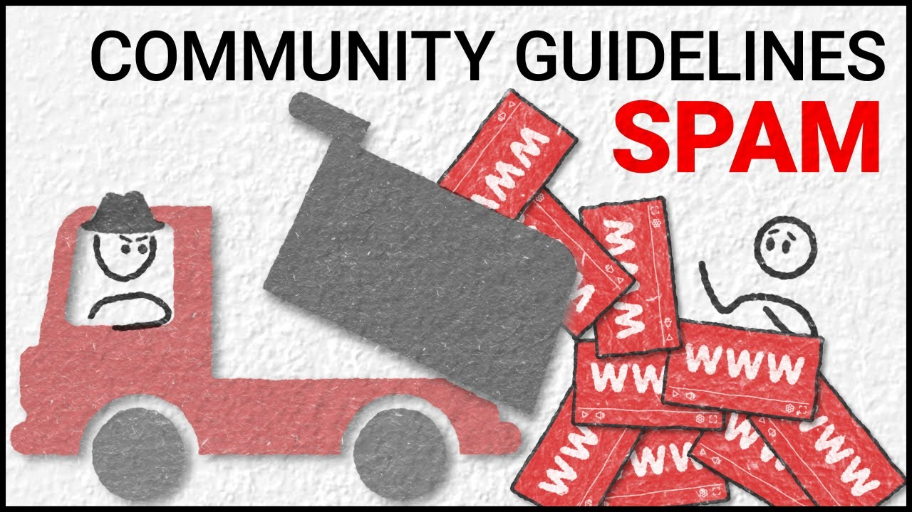

# Spam detection on youtube
<p align="center">
  
</p>

This application can tell you whether a comment is spam or not .

## First of all
 
check the web site of the app  [Site](https://youtube-spam-detectionlogistic.herokuapp.com). 

### help

Download the repositorie or clone it

```
Install all the requirements packages :

pip install -r requirements.txt
```
```
exectute the main file : app.py
```

## Other Information

The comments were collected via the YouTube API from five of the ten most viewed videos on YouTube in the first half of 2015. All 5 are music videos. One of them is "Gangnam Style" by Korean artist Psy. 
The other artists were Katy Perry, LMFAO, Eminem, and Shakira.